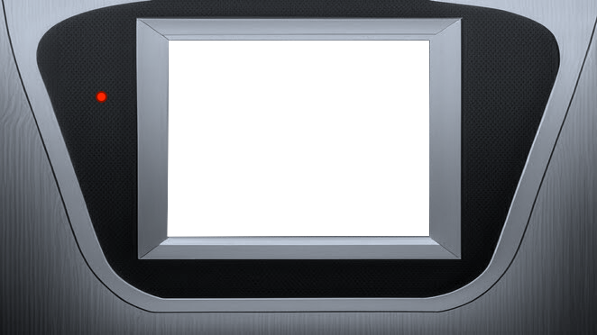

# Frame for GG Video

本リポジトリでは [Gearsystem](https://github.com/drhelius/Gearsystem) を [Screencast vokoscreenNG](https://linuxecke.volkoh.de/vokoscreen/vokoscreen.html) で撮影したキャプチャ動画と合成利用することを想定した枠素材を提供します。



## How to Use

Ubuntu での利用手順を記します。

1. Gearsystem を Video - Scale - Integer Scale (X3) の設定でゲームを起動
2. vokoscreenNG で Gearsystem のウィンドウをキャプチャ
3. ffmpeg コマンドを用いて crop & padding 


```bash
# GearsystemからvokoscreenNGで画面キャプチャ撮影 = movie.mkv

# Crop the game screen from movie.mkv (remove Window)
ffmpeg -i movie.mkv -vcodec libx264 -vf crop=w=574:h=424:x=1:y=31 movie_crop.mp4

# Add the padding for fit the frame.png
ffmpeg -i movie_crop.mp4 -vf pad=w=1284:h=720:x=356:y=94 movie_pad.mp4
```

あとは [frame.png](frame.png) と movie_pad.mp4 を動画編集ツールで合成します。なお、動画ツールによっては微妙にサイズが合わず調整が必要になる可能性がありますが概ね上手くいく筈です。（必要に応じてパディング座標を調整するなどして対応してください）

## License

[frame.png](frame.png) [CC0 1.0 Universal](https://creativecommons.org/publicdomain/zero/1.0/?ref=chooser-v1)

